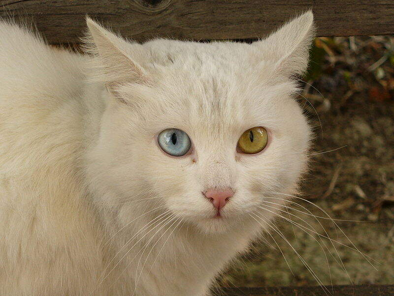

CatChat -- steganographic messaging with cat pictures
=====================================================

With [the EU wanting to backdoor](https://www.privateinternetaccess.com/blog/eu-continues-to-push-for-lawful-access-aka-backdoors-to-end-to-end-encrypted-data/)
encrypted messengers, the danger of secure encryption being banned is imminent.

Privacy is a right we are not willing to give away, and with **CatChat** we can
continue to use encryption without being detected (see the Security hints below)
by hiding our encrypted messages in EU-backdoored chat protocols.

We chose to use JPEG files to hide our messages in, because they are supported
by most chat services, they offer enough space to fit a text message, and most
importantly, they offer plausible deniablity: By using cat pictures as cover
images, nobody will suspect that you're committing the crime of using strong
encryption, because all they see is cat pictures. Instead, they will think that
you are just a normal person sharing the newest photos of your beloved pets with
your friends. Who needs words anyway if you can have cat pictures?!

(Example of a hidden chat message. See Credits below.)

Dependencies
------------

- libjpeg-turbo
- python-pynacl
- python-telethon

Building and configuring
------------------------

Execute `make` to build `libdct.so`.

Then, read the instructions in [private.py.example](private.py.example)
and create `private.py` with your own API token.

Running
-------

Launch the program using `python client.py`.

When asked for the key (or to generate one), press the Enter key
and save the generated key somewhere. You and your chat partner
must use matching keys, since this is your symmetric encryption key.

On the first launch, you will need to log into Telegram as usual.

Then, you can select the user to chat with and start typing messages.

Trying to encode too long messages into images with a too small capacity
will fail without a clear error message. The recipient will see "failed to
decrypt" without further explanation. Note how the "wrote to 1234 possible
bit locations" messages can give you a hint on this: Each message sent by
you takes approx. 48 + len(message) bytes. Multiply by 8 and you get the
required bits.

Feel free to tune dct.c to use the coefficients more efficiently.

Adding pictures
---------------

Create a `pic/` directory and place your favourite cat pictures
there. Note though, that they must not exceed 1280x720 pixels,
otherwise telegram will re-compress them, losing all information
hidden in the pictures.

Also note that they should not exceed a JPEG quality of 70.
Telegram will automatically lower the quality of your image
otherwise, destroying the least significant bits of the DCT
coefficients which we encode our information in.

How does it work?
-----------------

JPEG compresses images using the
[Discrete Cosine Transform](https://en.wikipedia.org/wiki/Discrete_cosine_transform)
on 8x8 px blocks of the image. It then reduces the precision of those
coefficients which are likely to be not noticeable anyway, leading to
a large number of coefficients being rounded to zero. Most of the actual
compression is achieved by simply not storing all these zeros.

This steganography algorithm performs a selection of these coefficients
(namely it uses, from each block, the last coefficient that is >32).
It then overwrites the least significant bit of this coefficient with 
one bit of the payload. Decoding works the other way round.

(Using only one coefficient per block is the main issue for the message
length being limited. Also, a better scheme would retain the distribution
of zero and one bits, see Security below.)

Limitations
-----------

No message backlog is supported. The UI sucks, deal with it. The texts
that can be hidden in a JPEG are laughably short, sorry. See below on
how a sensible steganography algorithm should be used.

Pull requests / forks are welcome.

Notes on security
-----------------

This is a really simple attempt at steganography. It is easily detectable,
because the LSBs in a JPEG file are not equally distributed. In fact, the
LSB's are 1 90% of the time. A steganogram can be recognized easily when
the number of ones in the LSBs is around 50%.

Use the F5 algorithm or a similar scheme to make it more difficult to get
detected.

Also, pictures are selected randomly at the moment. However, when hiding
different messages in the same JPEG file, the two generated files are
nearly bit-identical (with only very few bits -- the LSBs -- being changed).
Thus, reusing photos makes it very easy to detect that something must be
hidden in these images, destroying plausible deniability.

**Do not use.** Kthxbye.

Credits
-------

The [briciola](pics/briciola.jpg) cat picture was created by
[Peter Forster](https://www.flickr.com/photos/31818720@N00)
on 12 December 2006 and originally posted to Flickr as
[Il gatto Briciola, my friend with pretty eyes](https://www.flickr.com/photos/31818720@N00/320448119).
It is licensed under the
[Creative Commons Attribution-Share Alike 2.0 Generic license](https://creativecommons.org/licenses/by-sa/2.0/deed.en).
More information [at Wikimedia Commons](https://commons.wikimedia.org/wiki/File:Cat_Briciola_with_pretty_and_different_colour_of_eyes.jpg).

